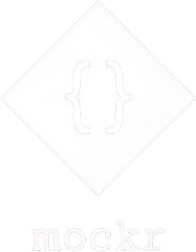

<p align="center">
  
</p>

<p align="center">fake a REST API from a JSON file — no backend needed</p>

<p align="center"><a href="https://ftobmeoww.github.io/mockr/"></a></p>

<br />

<p align="center">
  <a href="https://www.npmjs.com/package/mockr-cli"></a>
  <a href="https://www.npmjs.com/package/mockr-cli"></a>
  
</p>

<br />

## quick start

create `api.json` anywhere:

```json
{
  "GET /users": [{ "id": 1, "name": "Alice" }],
  "POST /login": { "token": "abc123" }
}
```

run it:

```bash
npx mockr-cli start
```

your site can now fetch from `http://localhost:3000`. done.

<br />

## options

```bash
mockr-cli start --config mocks/api.json --port 8080 --watch
```

| flag | default | |
|------|---------|---|
| `--config` | `api.json` | path to your config |
| `--port` | `3000` | port to run on |
| `--watch` | off | auto-reload on change |

<br />

## extras

set a custom status code:
```json
"GET /secret": { "_status": 403, "error": "Forbidden" }
```

add a response delay (ms):
```json
"GET /slow": { "_delay": 2000, "message": "slow response" }
```

every request is logged to the terminal automatically.

<br />

---

<p align="center">MIT · <a href="https://github.com/ftobmeoww">@ftobmeoww</a></p>
